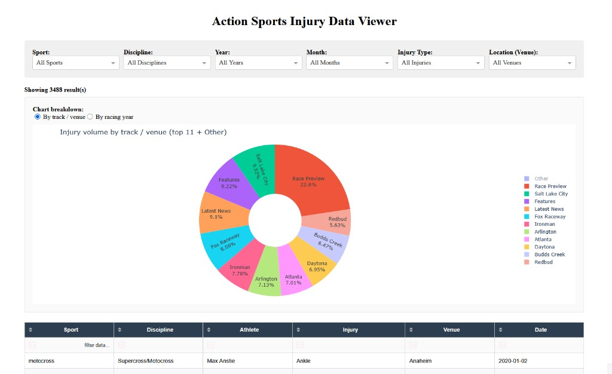

# Moto-WebParser

**Action-sports injury and crash data** — scrape multiple sources, merge and clean into one dataset, and explore it in a **Plotly Dash** web app.

## Preview

<div align="center">
  
</div>

<p align="center"><em>Filter injuries by sport, year, venue, and more; toggle the pie chart by track or racing year.</em></p>

---

## What this project does

- Collects links and article-style injury/crash information from configured sites (motocross injury reports, off-road news, BMX search results, etc.).
- Writes per-source text dumps (`data/injury_list_<source>.txt`), then **merges**, **standardizes**, and **deduplicates** into `data/updated_data.csv`.
- Serves an interactive **filterable table** and **injury volume pie chart** (by track/venue or racing year) in the browser.

---

## Quick start

**Windows (PowerShell)**

```powershell
cd Moto-WebParser
python -m venv .venv
.\.venv\Scripts\Activate.ps1
pip install -r requirements.txt
```

If activation is blocked by execution policy, run once: `Set-ExecutionPolicy -Scope CurrentUser RemoteSigned`

**Windows (Command Prompt)**

```cmd
cd Moto-WebParser
python -m venv .venv
.venv\Scripts\activate.bat
pip install -r requirements.txt
```

**macOS / Linux**

```bash
cd Moto-WebParser
python3 -m venv .venv
source .venv/bin/activate
pip install -r requirements.txt
```

**If you already have scraped `data/injury_list_*.txt` files**, build the app dataset and launch:

```powershell
python build_updated_data.py
python main.py
```

On macOS/Linux use `python3` instead of `python` if needed.

Open **http://127.0.0.1:8050** in your browser.

---

## Full workflow (scrape → build → view)

| Step | What to run | Output |
|------|-------------|--------|
| 1 | Activate your venv (see above) | — |
| 2 | Scrape all configured sources | `data/link_list_*.txt`, `data/injury_list_*.txt` |
| 3 | Merge + cleanse + dedupe | `data/injury_data.csv` → `data/updated_data.csv` |
| 4 | Start the UI | Dash server on port 8050 |

### 2. Scraping (Selenium + Chrome)

From the project root, using Python:

```python
from web_scraper.WebReader import webReader

# Everything: racerx, offroadxtreme, swapmoto, vitalbmx
webReader.scrapeAllConfiguredSources()
```

Or one source at a time:

```python
webReader.mainPageReader(source_id="racerx")          # discover links
webReader.scrapeInjuryData(source_id="racerx")        # fetch pages → data/injury_list_racerx.txt
```

**Chrome / ChromeDriver:** Selenium 4+ can match your installed Chrome automatically. If you see a version mismatch error, upgrade Selenium (`pip install -U selenium`) or align [ChromeDriver](https://developer.chrome.com/docs/chromedriver/downloads) with your Chrome version.

### 3. Building `data/updated_data.csv` (recommended)

One command merges every `data/injury_list_*.txt` (plus `data/injury_list.txt` if present), then cleans and dedupes:

```bash
python3 build_updated_data.py
```

**What that does**

- **Merge** — `DataOrganizer.discover_injury_list_files()` → `data/injury_data.csv`
- **Cleanse & dedupe** — `helpers.helpers.parse_injury_data_first_occurrence()` → `data/updated_data.csv`

**Cleansing (high level)** — see [`helpers/helpers.py`](helpers/helpers.py) for details:

- Canonical **sport** codes (`motocross`, `off_road`, `bmx`, …)
- Normalized text (whitespace, display casing) for athlete, venue, injury
- Dedupe on normalized **sport + athlete + injury + venue**, keeping the earliest date when both exist

**Manual split** (if you prefer):

```bash
python3 DataOrganizer.py
python3 -c "from helpers.helpers import parse_injury_data_first_occurrence; parse_injury_data_first_occurrence()"
```

### 4. Dash app

```bash
python3 main.py
```

The app reads **`data/updated_data.csv` only**. Rows **without a parseable date** are still shown (empty date column); use the **Year → “No date”** filter to focus on them.

---

## Supported sources (examples)

| Sport / theme | Notes |
|---------------|--------|
| Motocross / Supercross | [Racer X injury reports](https://racerxonline.com/category/injury-report) |
| FMX / moto news | [Swap Moto Live](https://www.swapmotolive.com/?s=injury) (search-driven) |
| Off-road / trucks | [Off Road Xtreme](https://www.offroadxtreme.com/?s=crash) |
| BMX | [Vital BMX](https://www.vitalbmx.com/) search |

Additional ideas (not wired in by default): [Thrasher Magazine](https://www.thrashermagazine.com/) news, etc.

---

## Data model (`data/updated_data.csv`)

| Column | Description |
|--------|-------------|
| `Sport` | Canonical code, e.g. `motocross`, `off_road`, `bmx` |
| `Discipline` | Finer grain, e.g. supercross, desert / trophy truck |
| `Athlete` | Person name (or placeholder when unknown) |
| `Rider` | Legacy mirror of `Athlete` |
| `Injury` | Injury or incident description |
| `Venue` | Track, event, or article-derived location label |
| `Track` | Legacy mirror of `Venue` |
| `Date` | `YYYY-MM-DD` when known; may be empty for some blog URLs |

---

## Project layout (main pieces)

| Path | Role |
|------|------|
| [`data/`](data/) | Scraped text lists, intermediate CSV, and app dataset |
| [`paths.py`](paths.py) | Shared `data/` path helpers for scripts |
| [`main.py`](main.py) | Dash UI and filters |
| [`build_updated_data.py`](build_updated_data.py) | One-shot merge + cleanse pipeline |
| [`DataOrganizer.py`](DataOrganizer.py) | Parse `injury_list_*.txt` → CSV |
| [`helpers/helpers.py`](helpers/helpers.py) | Dedupe + standardization |
| [`web_scraper/WebReader.py`](web_scraper/WebReader.py) | Selenium crawl + scrape per source |

---

## Legal & etiquette

Scraping can violate site terms or `robots.txt`. **Check each site’s rules**, crawl gently, and prefer official category/search pages as seeds. This tool is for personal/research use unless you have permission.

---

## See also

- [Selenium documentation](https://www.selenium.dev/documentation/)
- [requests](https://pypi.org/project/requests/) (listed for reference; scraping here is Selenium-first)

---

*A shorter machine-oriented copy of some commands also lives in [`README.txt`](README.txt).*
